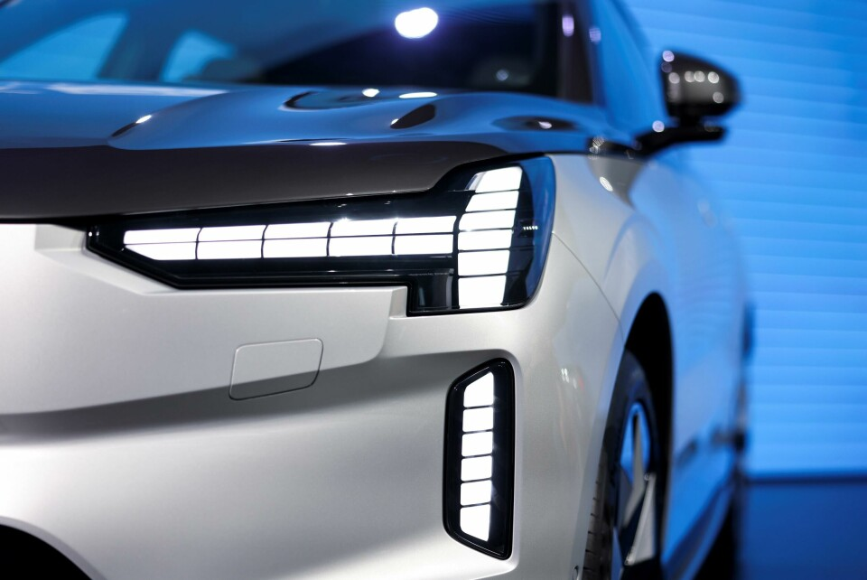
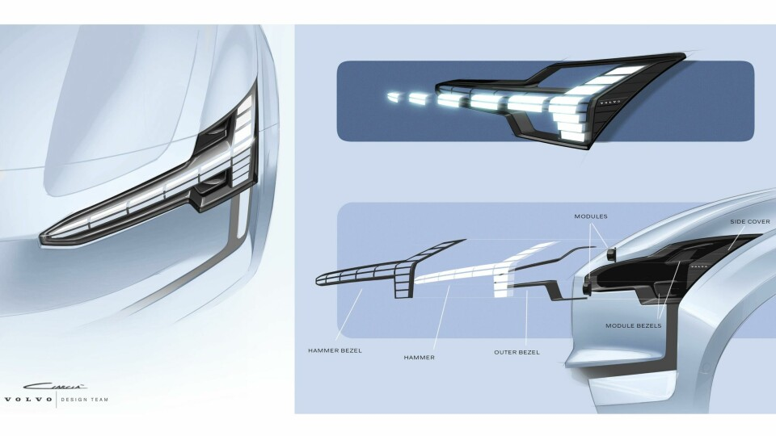
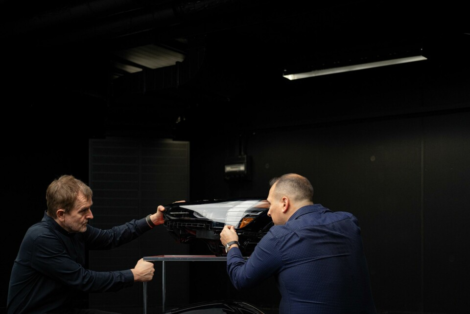

# 这辆车的灯，真的会“睁眼”

生活中的工业设计 · 美学与功能｜案例试稿 01

图 1｜Volvo EX90 前灯实物。图片来自 Car Design News 的 Volvo 灯光设计团队访谈；保留原图，未生成或改画。图中的灯带处于闭合外观，静态照片不展示完整开合动作。

## 正文

晚上走近一辆车，灯先亮起来，接着像眼皮一样打开。车还没动，你已经觉得它醒了。

Volvo EX90 把这个动作做进了车灯里。它延续了“雷神之锤”的轮廓：一条横向灯带，在外侧接上竖线。不过，原来连贯的光，现在被分成一小块一小块。

先看它为什么好看。细长的横线把视线拉向车身两侧，车头显得宽而平稳；外侧的竖线收住轮廓。白色灯带嵌在深色灯腔里，明暗对比清楚。分段又让这张“脸”多了一点数字设备的感觉。

漂亮的线条也带来一个实际问题：主要照路的灯，放在哪里？

在设计团队的访谈里，这件事说得很具体。团队想收窄灯组外形，于是把远近光模块放到了横向灯带后方。需要照路时，横向部分分开、让出位置，后面的灯露出来。日间行车灯的识别轮廓，和远近光的照明任务，在同一套结构里分工。[1][2]

图 2｜设计团队的前灯方案图，来自同一访谈。这是设计图，不是拆解测量记录；用于说明外形与部件布置的关系。

但“睁眼”的意思不止于腾出空间。团队还希望灯光与机械动作给车辆一点性格：靠近、解锁时醒来，停车离开时睡去。Volvo 的官方介绍也把迎宾动作比作欢迎回家。[1][2]

这个意图能从形式里看出来。只亮一条线，像是在显示状态；让这条线动起来，整张车脸就有了表情。光的节奏、部件的运动和我们熟悉的眼睛动作，凑成了一次很短的表演。

当然，觉得它亲切，并不能说明它更可靠。我们能看懂造型，也能查到设计团队的解释；长期好不好用，还要看实际使用。

图 3｜设计团队在灯组实物旁讨论。图片来自同一访谈，用于交代设计背后的协作过程，不据此推断测试结果。

这让我想到家门口那盏留着的灯。灯本身没有感情，但有人把它留给你，意义就变了。车灯也借用了这样的生活经验，把一次解锁做成了招呼。

你会喜欢这种“被迎接”的感觉吗？如果一件机器让你觉得它在等你，你对它的信任，会不会也比平时多一点？

#工业设计 #车灯设计 #设计美学 #沃尔沃EX90 #生活中的设计

---

## 研究依据

1. [Volvo 灯光设计团队访谈，Car Design News，2024 年 3 月 19 日；页面标注 2025 年 7 月 2 日更新](https://www.cardesignnews.com/lighting/volvo-on-people-awards-win-and-lighting-design/493617)：来源是参与设计者的访谈，支持模块后置、机械开合及迎宾意图的陈述。品牌的性能评价不作为本稿独立验证的结论。
2. [Volvo EX90：Thor’s Hammer 的眨眼，Volvo Cars 瑞士官方介绍](https://www.volvocars.com/de-ch/news/corporate/volvo-ex90-das-zwinkern-von-thors-hammer/)：支持灯组开启与迎宾动画。文章针对 EX90 所介绍的结构，不推广为所有 Volvo 或全部地区配置的共同特征。

## 选题与素材记录

这是历史“雷神之锤车灯”选题的深化稿，新增核心问题为：机械与光的动作如何把功能部件变成亲近感的表达。以前的文字样稿没有完整论点，不能宣称已完成所有历史论点的排重。

三张图在本任务历史表中未发现同源 URL 或相同文件指纹；已逐张观察本次素材。历史没有覆盖其他 AI 的完整产出，检查范围仅限已提供记录。图片在交付时登记使用，实际小红书发布状态未知。
