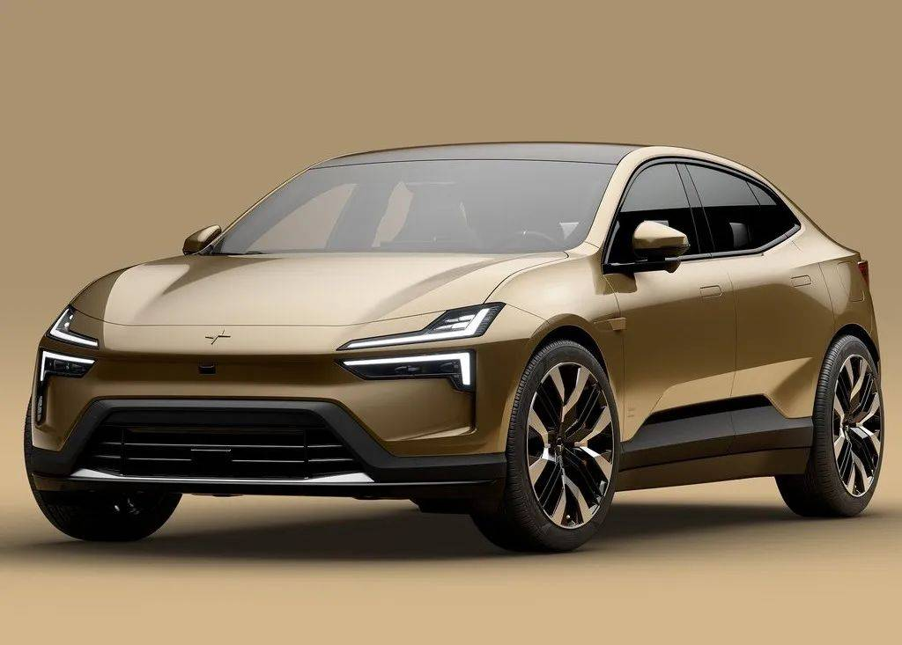
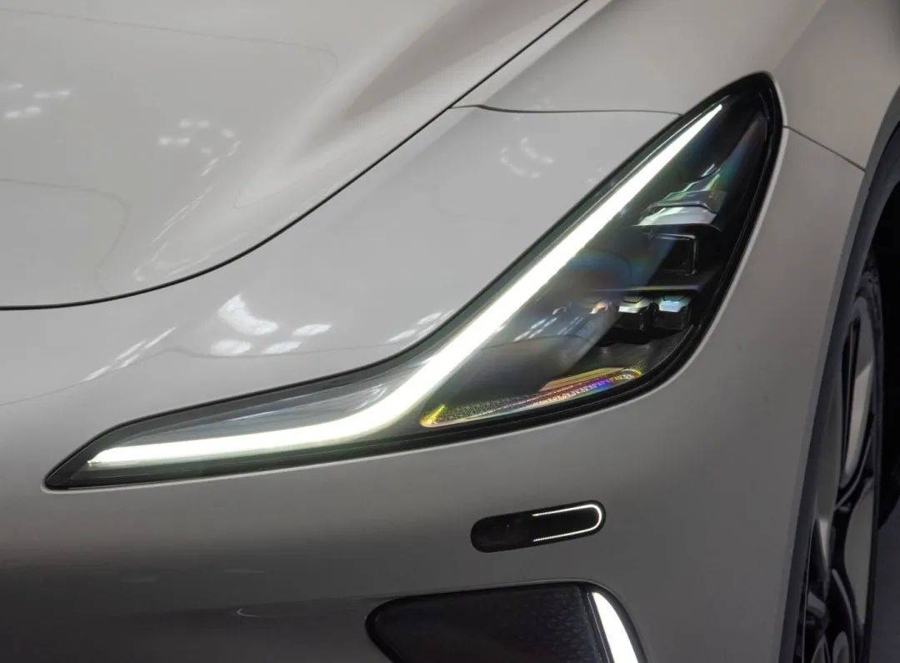
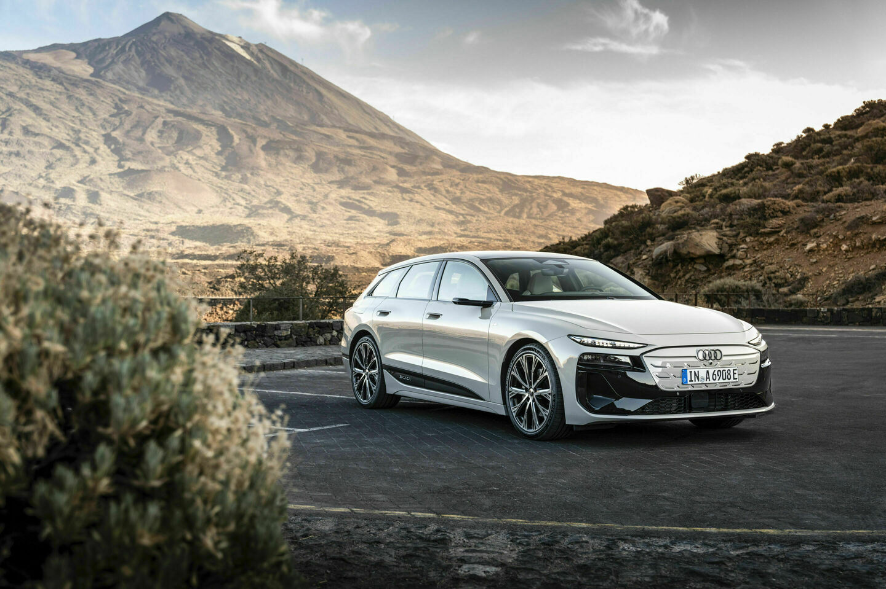
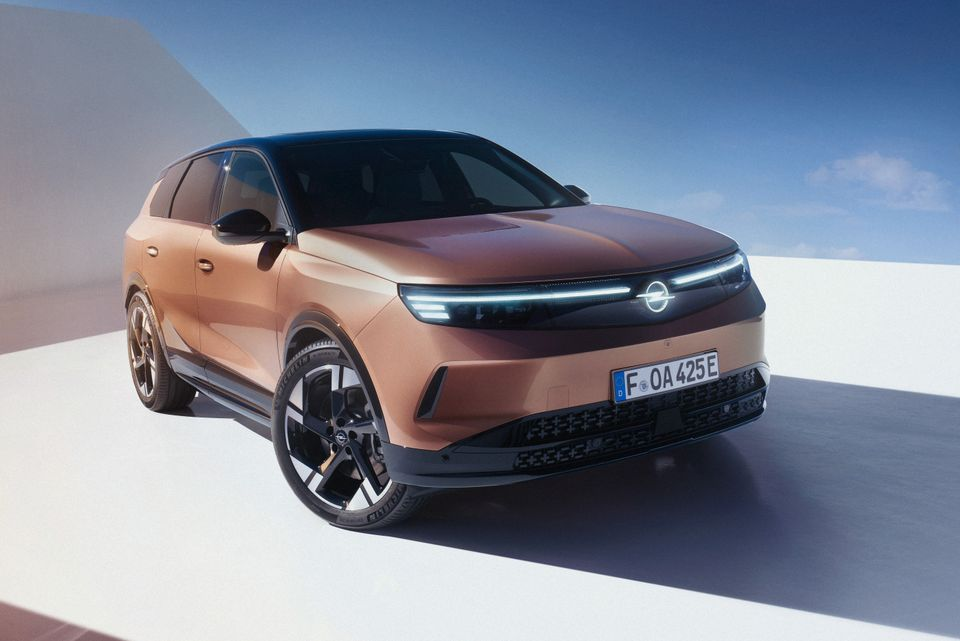

# 好看的车灯，究竟好看在哪里？

生活中的工业设计 · 美学与功能｜案例 01 · 比较长文 v0.2

图 1｜Polestar 4，2023 年车灯评选公布页的外观图。观察上下灯带、间隙与车头整体的关系。原图保留，未生成或改画；出处见文后。

## 正文

有些车只露出两道灯，我们就认得出品牌。也有些车，灯光很复杂，第一眼却留不下清楚的印象。

差别在哪儿？把几种车灯放在一起看，会比只谈一辆车更容易发现：我们喜欢的，常常是灯与灯之间、灯与车身之间恰好合适的关系。

从美术的形式分析入手，可以先分成两层：线、形、明暗和空间是我们看到的元素；比例、均衡、节奏和主次，是组织这些元素的方法。接下来不用记一串术语，每种车灯先讲一个概念，再对着图片看它怎样发生作用。[9]

先回答一个容易被标题带偏的问题：哪些车灯确实获得过“好看”的认可？

2023 年第四届中国最佳车灯评选，把极星 4 前灯选为外资类别的“年度颜值车灯”，把智己 LS7 前灯选为自主类别的“年度颜值车灯”。这次评选中，网友、注册评委、特邀评委的权重分别为 20%、50%、30%。它能证明这两个设计在那次评选中获胜，不能证明所有消费者都更喜欢它们。[1]

另一个有数字的参考是 2025 年 DVN 前灯评选：Opel Grandland 得票占比 26%，Audi A6 Avant e-tron 为 23%，DS N°8 为 16%。公告写有来自 122 家公司的 796 票，但没有公开前灯类别单独的有效票数，也没有把外形喜好与技术表现分开。这是综合行业投票；26% 与 23% 的差距，不能被写成审美上的确定胜负。[2][3]

有了这些依据，我们选极星 4、智己 LS7、Audi A6 Avant e-tron 和 Opel Grandland，再把原来讨论的 Volvo EX90 放进来。五个设计服务于相近的前部照明与识别任务，外形却走了不同方向。这次比较不按车价、品牌档次或照明性能排座次，重点看它们怎样组织视觉。

## 极星 4：两道线之间的空隙，也参与了设计

**先认识“统一与变化”**：几个元素有共同特征，让我们觉得它们属于一个整体；其中保留差别，整体才不会单调。

极星 4 的“双刃”灯有上下两层。上面的灯带在外侧向上挑，下面的灯带向下折，中间留着一道清楚的间隙。品牌介绍说明，这套形态延续了 Precept 概念车的设计语言。[4]

这道间隙很关键。如果把两层填满，我们看到的可能就是一块面积不小的灯。现在，视线先抓住两条细长的轮廓，随后才注意到里面的部件。灯组显得更薄，车头也少了一点厚重。

上下的线条相似，却没有完全重复：它们都有横向延伸，但在两端朝不同方向展开。相似让两层看起来属于同一套设计，变化又避免了机械地叠两条直线。这里能看见美学里的“统一与变化”——先给眼睛一个可辨认的秩序，再在这个秩序里留一点差别。

再看灯外面的车身。车头有大面积平整的表面，周围没有很多装饰线与灯争夺注意。细灯带因此显得利落。如果把同一组灯塞进满是折线和开口的前脸，效果未必还会这么干净。**简洁取决于元素之间的安排，不能只数零件有多少。**

## 智己 LS7：转折没有画得很硬，线条就有了流动感

图 2｜智己 LS7 前灯近照，来自同一评选公布页。照片中的反光和曝光不用于比较灯光亮度；这里观察轮廓、弧度与周围车身面。

**先认识“视觉动势”**：形状并没有真的移动，线条的方向与弯曲却可以引导我们的视线，让静止物件带出运动的感觉。[9]

LS7 的灯带从靠近车头中间的一端出发，先横向延伸，再向外侧抬起来。它不像 EX90 那样，用一个明显的直角收住横线；转弯处有弧度，宽度也随着轮廓变化。

因此，眼睛沿着线走时，不会在折角处突然停住。它更接近一笔画出来的曲线，有连续的方向感。这是“连续性”在具体物件上的表现：线条转折得顺，视线就容易跟着走。它不等于曲线一定优于直线，直角也可以表达坚定和秩序；两者只是给出不同性格。

照片里，灯的上缘与引擎盖、翼子板交界处的走势相互呼应。灯没有孤立地贴在一块车身面上，而是接上了周围形体。把视线从灯移到车身，方向没有被打断，所以局部显得协调。

细尖的内侧与更高的外侧又拉开了两端的差别。这个轮廓容易使人联想到向外挑起的眼角，带来一点锐利感。但它的圆滑转折和较完整的曲面又缓和了这种锐利。我们说它“流畅”，就有了可以指给人看的原因：方向连续、转折有弧度、局部与车身接得上。

## Audi A6 Avant e-tron：把复杂的部分退到暗处

图 3｜Audi 官方 A6 Avant e-tron 照片册中的车型照片，编号 A244694。用于观察细灯与下方黑色区域的层次，不把不同照片中的曝光差异当作光学测试。

**先认识“明度对比与视觉主次”**：明度就是我们看到的明暗程度；明暗差别与面积、位置一起，影响哪些部件突出、哪些部件退后。[9]

Audi 把日间行车灯放在上方，做得很细；主要照明部件则放在更低的位置，融入前脸的深色面罩。设计师 Sascha Heyde 在访谈中解释，体积较大的灯光技术部件如果都突出在上面，会在视觉上增加车头的高度；藏入暗色区域，是为了保留较平、较宽的外观。[5]

看照片时，可以先把注意力放在上面两条灯。它们的高度很小，横向长度却清楚，像是在车头上划了两道窄线。下面的照明部件仍然存在，但边缘与黑色背景接近，不会同样强烈地跳出来。

这种处理建立了**视觉主次**：最容易被看见的是上方的光形，体积较大的功能部件退后。做海报也会遇到类似的事——标题必须明显，其他信息才能安静一点。每个元素都同样突出，反而很难形成清楚的第一印象。

它还有比例上的作用。横向的细线把视线带到两侧，暗色区域削弱了下方部件的分块感，车头于是容易被读成宽而低的一张“脸”。这不改变车辆的实际尺寸，只改变照片里哪些边界最先进入我们的注意。

可选数字灯光图案会带来进一步变化，不过型号和配置不同，图案也不同。这里不拿某一种灯语代表所有 A6 e-tron。我们分析的是相对稳定的安排：上方强调形象，下方容纳较复杂的功能。[5][6]

## Opel Grandland：让两盏灯成为一个完整的前脸

图 4｜Stellantis Norge 在 2024 年新 Grandland 新闻稿中公布的外观图。照片展示品牌前脸灯光；可见的灯带与内部用于照路的光源数量不是同一个指标。

**先认识“对称均衡”**：以一个中心为参照，左右的形与视觉分量相互呼应。这里的“分量”是看起来的存在感，和零件实际多重无关。[9]

Grandland 最明显的做法，是把左右灯、横向的光和中间发光的车标放进同一个深色区域。品牌把这套前脸称为 3D Vizor，官方介绍也强调横向延伸的 Edge Light。[7]

和极星 4 比，极星保留了灯组之间的间隙，Grandland 则更强调横向连接。我们容易顺着那条光，从一侧看到中间，再看到另一侧。左右灯不再只是两个分开的部件，而像是同一个形体的两端。

中间的标志提供一个停留点。横线会把视线往两边拉，车标又把它收回中心；左右对称的安排因此有了明确的中心和两翼。在这张外观图中，它显得整齐、完整，车头的宽度也更容易被感受到。

背后的光学技术为照路服务，前脸的灯光图形则帮助我们辨认它。Grandland 获得的 DVN 奖项认可了整个前灯方案。它并没有单独告诉我们，投票者究竟更喜欢这条横线、中心车标，还是照明能力。因此，好看的原因仍要回到可见的组织方式去解释，不能把一个技术参数直接翻译成美感。

## Volvo EX90：用重复的小块，构成一个稳定的大形

图 5｜Volvo EX90 前灯，来自 Car Design News 的设计团队访谈。沿用本篇上一版已登记的原图，属于同稿修订；照片不展示完整机械开合过程。

**先认识“重复与节奏”**：相似单元反复出现，会建立秩序；它们的间距、大小、明暗及变化方式，组成我们感受到的视觉节奏。[9]

最后看回 EX90。它的横线较明确，外侧的竖线也很明显，构成容易记住的“雷神之锤”轮廓。和 LS7 的流动曲线比，这里更强调直线、直角和清楚的边界。

近看时，横向灯带又分成了一小块一小块。重复的小单元让光有了节奏：眼睛能感到它们被有规律地排在一起。远一点看，这些单元会先被读成整体的横线；近一点看，分段又提供了细节。它于是同时有大形的清楚和近看的层次。

这正是“节奏与整体”的关系。重复可以使设计有秩序，但如果分块过碎、亮暗差异过大，整体也可能被切散。EX90 的分析重点应当是照片里这些单元怎样共同维持一个锤形，而不能把“灯珠更多”当作审美结论。

设计团队还用机械开合，让后方照明模块在需要时露出。这给稳定的轮廓增加了动作，不过动作应当作为另一个观看维度，不必替代静态造型的解释。[8]

## 放在一起看，原理就清楚了

极星 4 利用间隙和相似而不相同的线条，显得轻巧；LS7 让转折与车身走势连续，显得流畅；Audi 用明暗安排主次；Grandland 用连接和对称组成完整前脸；EX90 用重复单元维持稳定的轮廓。

这些做法没有给出一张人人都要同意的审美榜单，却能帮助我们把“我觉得好看”说得更具体。下次看车灯，可以先看四件事：线条往哪里走，亮与暗怎样分工，部件之间留下多少空间，灯的形状有没有接上整辆车的形状。喜欢哪一种仍然可以不同，但美感是怎么形成的，已经能从图里找到。

#工业设计 #车灯设计 #设计美学 #美学原理 #生活中的设计

---

## 研究依据

1. [2023 年第四届中国最佳车灯评选结果，车灯研究院，页面更新日期 2024-01-31](https://www.dengdengschool.com/article/zuimeichedengtoupiaohuodong/1667.html)：主办方公开获奖身份、评委类别及 20/50/30 权重。未提供可复算的原始票数或总体代表性。部分评委评语有重复文本，本稿不据此推断 LS7 的具体光学结构。图 1、图 2 来自该页。
2. [2025 DVN Award，DVN 的 Paul-Henri Matha，2025-02-21](https://www.linkedin.com/pulse/2025-dvn-award-paul-henri-matha-tdeee/)：公开前灯候选、前三名占比及整体的 796 票、122 家公司。没有前灯类分母、去重规则与原始明细，不计算人数、置信区间或显著性；前三名占比也不是五辆比较车型的统一排名。
3. [DVN Award Ceremony 2025，主办方](https://www.drivingvisionnews.com/boutique/previous-workshops/dvn-award-ceremony-2025/)：说明参与者来自照明产业链，写的是约 800 位、122 家公司。此处保留来源口径，不把活动出席人数、投票者与票数混为一谈。该奖包含技术与设计，不是纯外形调查。
4. [Polestar 4: everything you need to know，Polestar，2024-02-01](https://www.polestar.com/uk/news/polestar-4-everything-you-need-to-know/)：设计负责人介绍双刃灯对 Precept 设计语言的延续。间隙、轻巧与统一变化是本文对原图的分析。
5. [Audi 外观设计师 Sascha Heyde、Wolf Seebers 访谈，2024-08-06](https://www.audi.com/en/press-releases/audi-a6-e-tron-as-exciting-as-the-show-car-16122)：支持较大照明部件放入暗色面罩、保留扁宽视觉比例的设计意图。
6. [Audi A6 e-tron 官方 Design 说明，2024-12-03](https://www.audi.com/en/the-audi-a6-e-tron-the-new-electric-avant-garde-16391/design-16395)：支持日行灯、主灯与暗色区域的安排；图 3 来自 [A6 Avant 官方照片册](https://www.audi.com/en/photos/album/audi-a6-avant-e-tron-2592)，编号 A244694。没有把概念车或 S6 图片当成 A6 Avant 的同一配置。
7. [Grandland 灯光与 3D Vizor，Opel 官方，2024-10-28](https://www.media.stellantis.com/em-en/opel/press/new-opel-grandland-with-intelli-lux-hd-light-br-scary-nights-a-thing-of-the-past)：支持横向灯光、发光车标等设计身份，不采纳“行业最好”等宣传评价。图 4 来自 [Stellantis Norge 的 2024-04-23 发布稿](https://kommunikasjon.ntb.no/pressemelding/18069448/nye-opel-grandland-fra-konsept-til-virkelighet?lang=no&publisherId=16656993)。
8. [Volvo 灯光团队访谈，Car Design News，2024-03-19；页面更新 2025-07-02](https://www.cardesignnews.com/lighting/volvo-on-people-awards-win-and-lighting-design/493617)：图 5 及机械开合说明。本文没有宣称 EX90 在上述评选中获奖，也不把它未列入名单解释为不受喜欢。
9. Getty Museum 的 [Elements of Art](https://www.getty.edu/education/teachers/building_lessons/formal_analysis.html) 与 [Principles of Design](https://www.getty.edu/education/teachers/building_lessons/formal_analysis2.html)，以及其 [设计原则教学讲义](https://www.getty.edu/education/teachers/building_lessons/principles_design.pdf)：用于核对基础术语，以我们自己的语言简化介绍。车型中的具体视觉判断是本文分析，不是 Getty 对这些车型的评价；这些术语也不是“人人都会更喜欢”的实验结论。

统计口径、排除的数据以及选择依据另见 [车灯数据核对表](../research/headlight-evidence.md)。这五辆车用于比较设计方法，不是价位、车身类别、照明性能的受控试验；摄影角度、曝光、车身颜色不同，不据此测量实际亮度、尺寸或喜爱比例。

## 选题与素材记录

这是同一篇车灯案例的 v0.2 修订。由单车与亲近感分析改为五种前灯设计比较，核心为具体形态如何体现美学原理。旧版保存在 GitHub 提交及 v0.1 下载包中；完整 Skill 尚未生成。

新增四张图在已提供项目历史中未发现已知同源 URL 或同文件指纹；Volvo 原图作为同稿修订沿用并注明关系。所有图片保留原始来源身份，未用 AI 生成或重画。实际小红书发布状态未知。
