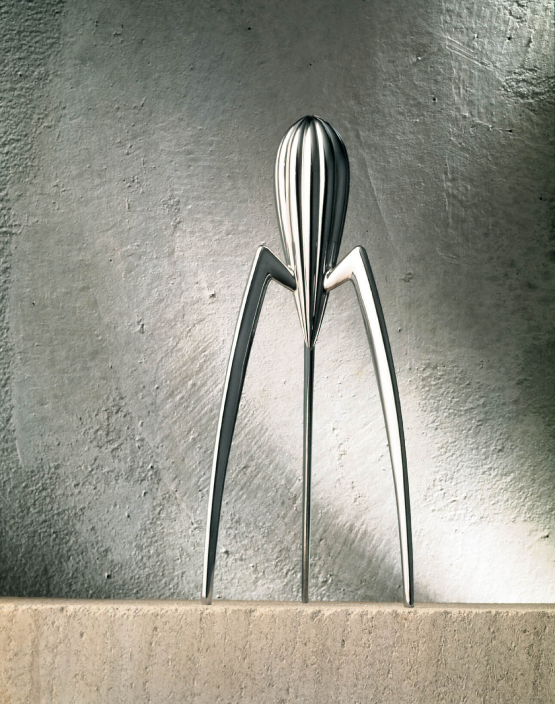
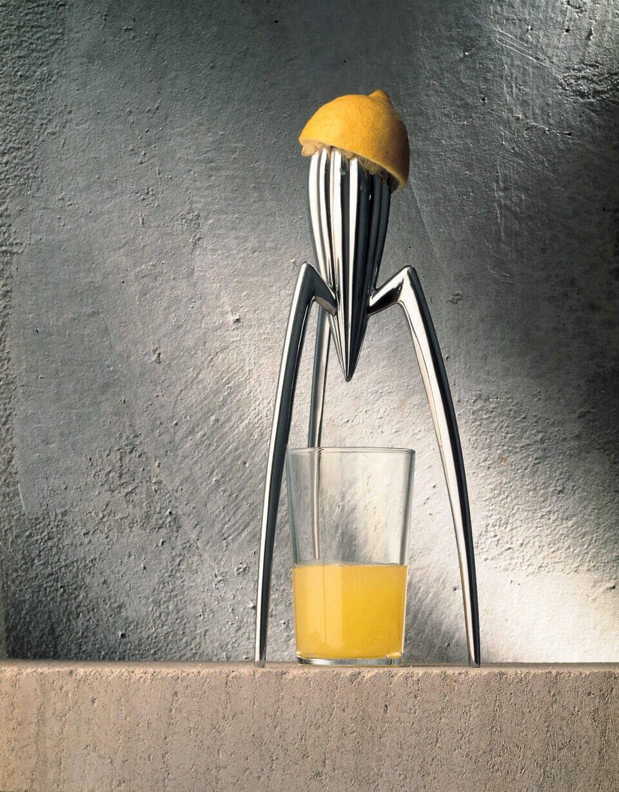
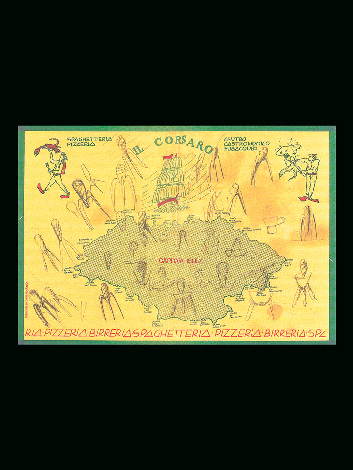

# 这件小雕塑，居然是榨汁器

生活中的工业设计 · 美学与功能｜案例 02 · 美学分析长文 v0.2

图 1｜Philippe Starck 为 Alessi 设计的 Juicy Salif。原始产品照片来自设计师官网；未生成、改画或裁切。设计与摄影权利归原权利人，照片页面见文后来源。

## 正文

三条长腿，托着一个尖长的金属身体。远远看，它像一件小雕塑，甚至像一只停在台面上的外星生物。

它其实是 Philippe Starck 为 Alessi 设计的 Juicy Salif 榨汁器。设计师官网和 MoMA 把设计记录在 1988 年；不同馆藏对年份的标注略有差别。[1][2] 它的用途很简单，但形状为什么会让人多看几眼，值得慢慢拆开。

## 长腿与小身体：比例先改变了印象

**先认识“比例”**：一部分与另一部分、局部与整体的大小关系。[6] 看这件物品时，重点是腿的长细与身体的大小怎样相处，不需要先套某个固定的“完美比例”。

先看中央那块带沟槽的体块。它靠近顶部比较饱满，向下逐渐收尖。三条腿从它周围伸出，向外弯开，最后落到台面上。与中央身体相比，腿显得很长，也很细。

这组比例让它有了轻巧感。中央的实体没有一直延伸到台面，中间大半是空的，我们会先注意到细长的支撑和悬起的身体。如果把腿想象成几根粗短的柱子，即使材料和主体都不变，整个物件也会显得更敦实。

所以，“轻”首先是一种视觉印象，来自实体与空间的分配；它不等于物件实际重量小，也不能证明受力时稳定。把视觉判断和使用事实分开，才能把原因讲清楚。

腿也没有笔直地垂下。向外展开的弧线，使站姿显得更舒展；从侧面看，弯折处又像关节。这让一件静止的金属工具看上去带着一点动作。我们联想到动物，是从可见的结构开始：一个身体，几个细长的支点，一种像是在停步的姿态。

## 中间的空白，让用途和轮廓一起变清楚

被托高的主体下面，刚好留出放杯子的空间。切开的柠檬压在顶端，汁液沿着表面向下流，滴进下面的杯子。[3]

图 2｜设计师官网的使用情境照片。柠檬、沟槽和玻璃杯说明汁液路径；照片并不证明榨汁效率或操作稳定性。

这里的空隙有两个作用。使用时，它容纳杯子；观看时，它把三条腿的轮廓分开，让每条线都能被辨认。杯子放进去以后，上面的金属与下面的透明玻璃，又形成两种不同的质感。

美术里常说的“正负形”，可以在这里简单理解：金属本体占据的形是正形，它周围以及腿间空出来的区域是负形，也常称负空间。[6] 空白并不是什么也没做的地方。图中腿与腿之间的空处，让支撑显得疏朗，也把中央尖端凸显出来。只盯着金属本身，容易漏掉这一半形状。

这也解释了它为什么适合被当成雕塑观看：没有杯子时，我们可以从腿间看到背景，视线能穿过物件；放入杯子时，原来空出来的地方又成为使用场景的一部分。外形随着是否使用而改变，但中间的空间始终是结构的重要部分。

## 重复的沟槽：让金属有了可读的节奏

**先认识“视觉节奏”**：相似元素有规律地重复，并通过间距、方向或大小的变化组织观看。[6] 就像我们听音乐能感到节拍，眼睛也能感到图形的重复和变化，但它并不要求物件真的动起来。

再近一点看中央主体。沟槽沿着表面排列，明亮的凸起与较暗的凹处交替出现，越向下越往尖端收拢。相近的单元重复，使表面有秩序；整体由宽到窄，又给这种重复一个明确方向。

这和在纸上画很多平行线不完全一样。沟槽长在曲面上，受光的位置不同，亮暗也会改变。我们顺着这些细条，能感到身体的弧度和厚度；平面照片于是仍然传达出立体感。

重复太平均，有时会显得呆板。这里，主体轮廓的收放、腿的弯折和高光的位置带来了变化。大部分细节仍然朝向相同的纵向走势，物件就不会因为细节多而散开。

**节奏可以来自重复，层次则来自重复中的变化。** 这件作品把两者放在同一个表面上：远看是一个清楚的体块，近看才出现沟槽、明暗和转折。

## 材料没有被藏起来

这里可以同时看“明度”和“肌理”。明度是明暗程度；肌理是表面的性质，比如光滑或粗糙。[6] 我们只能从照片观察视觉质感，不能把它说成已经亲手触摸过。

经典银色款的主体是铸铝。[1] 它没有靠鲜艳颜色来吸引注意，表面的金属光泽就承担了表达。图里，细腿迎光的一侧较亮，另一侧较暗，弧线因此有了清楚的边界。

轮廓让它像某种生物，金属又让它保持工具的质感。这两个印象并存，是它比一个直接模仿动物的小摆件更有意思的地方：形态给出联想，材料保留了距离。读者不必先知道设计史，也能从这组关系进入作品。

Starck 在多年后的回顾中，把它解释为能够激发想象、引起交谈的小雕塑。[4] 这个陈述与陌生而易于联想的轮廓相吻合，但它是后期解释，不能替代对照片中具体细节的分析。

图 3｜Alessi 产品档案标注为 1988 年餐垫草图。它展示形态探索；不把草图中的每个形状都认定为已定型的榨汁器方案。

## 形状与用途，在哪些地方相互支持？

托高的主体给杯子让出空间，表面的沟槽提供汁液向下的路径。这些是形式与功能相互配合的地方。与此同时，这个结构没有配套筛网替你分开籽和果肉，想要细腻的汁，可能还要另行过滤。Aberdeen 的馆藏说明也明确写到这一点。[3]

因此，美学分析可以说明它为什么有吸引力，却不能直接推出它更好用。长腿、空隙和尖端构成了鲜明轮廓；实际操作是否合适，还要考虑握持、清洁和个人的使用习惯。本稿没有比较实验，不替它给出效率或稳定性排名。

再看第一张图，Juicy Salif 的特点已经比较具体了：长与短的比例让它轻巧，腿间的空隙让它疏朗，沟槽的重复与收拢形成节奏，金属表面的明暗让形体立起来。我们最初觉得它像雕塑，正是这些安排一起产生的结果。

#工业设计 #产品设计 #设计美学 #PhilippeStarck #Alessi #生活中的设计

---

## 研究依据

1. [Juicy Salif，Philippe Starck 官网](https://www.starck.com/juicy-salif-alessi-p2009)：设计记录、铸铝材料、餐桌上的形态探索；图 1 和图 2 来自该页。
2. [Juicy Salif Lemon Squeezer，MoMA 馆藏记录](https://www.moma.org/collection/works/1825)：标注 1988 年。不同机构有 1990 或其他年份记录，因此本稿保留来源口径，不把设计、生产与特定藏品制作年份混成一个日期。
3. [Juicy Salif Citrus Squeezer，Aberdeen 市立博物馆藏品说明](https://emuseum.aberdeencity.gov.uk/objects/89829/juicy-salif-citrus-squeezer)：汁液直接进杯，包含籽和果肉。没有独立比较实验，本稿不使用“最差榨汁器”等性能排名。
4. [Juicy Salif Study n.3，Starck 官网，2021 年 12 月 1 日](https://www.starck.com/alessi-100-values-juicy-salif-n-3-p4490)：设计师对想象、小雕塑及交谈的后期陈述。该页介绍青铜研究版本，本稿照片和功能分析针对经典银色款，不混用版本参数。
5. [Juicy Salif，Alessi 官方产品档案](https://us.alessi.com/products/juicy-salif-citrus-squeezer)：图 3 的餐垫草图及档案标题。关于最初委托，品牌页与设计师页说法不同，本稿不采用这一故事细节。
6. Getty Museum 的 [美术元素教学资料](https://www.getty.edu/education/teachers/building_lessons/formal_analysis.html) 与 [设计原则讲义](https://www.getty.edu/education/teachers/building_lessons/principles_design.pdf)：基础术语依据。本文用自己的语言简化介绍，并对 Juicy Salif 作独立分析，不将简化概念写成普遍审美定律。

## 选题与素材记录

本篇 v0.2 以比例、负空间、节奏、材料光泽与功能关系为中心，删去生活反思式结尾。榨汁器本身也有同类产品；此次按用户要求采用单件细读，不把“不比较”解释为没有同类。旧版保存在 GitHub 历史与 v0.1 下载包。

三张原图作为同稿修订沿用，保留原始来源与既有使用身份；这不是三张新素材。历史没有覆盖其他 AI 的完整产出，实际小红书发布状态未知。
